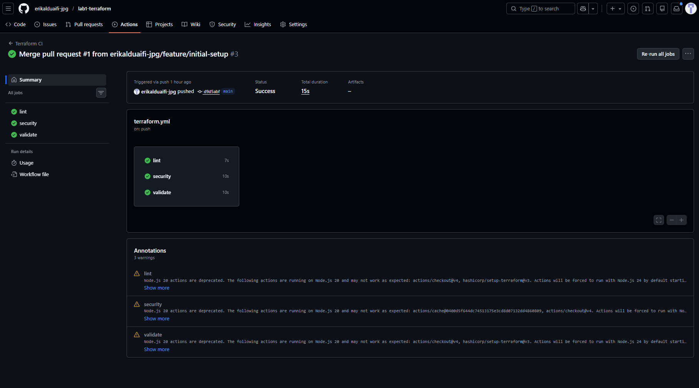
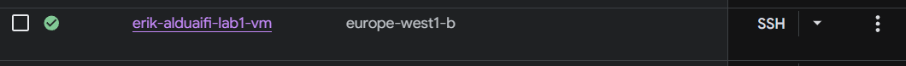

# Lab 1 – Terraform

## Vad projektet gör

Projektet använder **Terraform** och **GitHub Actions** för att skapa en Ubuntu-baserad VM i Google Cloud. Terraform används för att automatiskt skapa infrastrukturen, medan GitHub Actions kör olika kontroller när man pushar kod till GitHub.

När pipelinen körs i GitHub Actions kontrolleras Terraform-koden så att den är korrekt skriven, följer rätt struktur och inte innehåller några uppenbara säkerhetsproblem.

Projektet skapar också en **backup policy** så att VM-maskinen säkerhetskopieras dagligen.

När VM:n startar körs även ett **startup-script**. Scriptet gör några enkla säkerhetsåtgärder, till exempel installerar en brandvägg och andra säkerhetsverktyg. Scriptet skapar också en loggfil så att man kan se om något gick fel under installationen.

---

## Hur man kör projektet

För att kunna köra Terraform behöver man ha **Terraform installerat** och ha projektets `.tf`-filer i den mapp där man kör kommandona.

### Kör Terraform-kommandon för att initiera, planera och sedan applicera koden
terraform init
terraform plan
terraform apply

#### Screenshot över terraform pipeline:
<p align="center">
  
</p>

#### Screenshot på Google Cloud GCP Console:
<p align="center">
  
</p>

## Säkerhetsbeslut

### UFW
UFW används som brandvägg för att kontrollera vilka anslutningar som får nå servern. 
Eftersom servern är exponerad mot internet är en brandvägg nödvändig för att blockera 
obehörig trafik och minska risken för intrång.

### Fail2Ban
Fail2Ban används för att skydda servern mot brute-force-attacker och automatiserade 
inloggningsförsök. Om någon försöker logga in fel flera gånger blockeras IP-adressen 
automatiskt under en viss tid.

### Backup
Backuper konfigureras för att skydda data om något skulle gå fel, till exempel om en 
server kraschar eller data raderas av misstag.

I `main.tf` används resursen:

`google_compute_disk_resource_policy_attachment.backup_attachment`

Den tillhörande policyn gör att en backup tas varje dag.

### Trivy
Trivy används för att automatiskt skanna Terraform-konfigurationen efter säkerhetsproblem 
och felaktiga inställningar. Detta gör att sårbarheter eller misstag kan upptäckas tidigt.

### Ägandeskap
Resurser märks med labels så att det går att identifiera vem som äger dem och vilken 
miljö eller kurs de tillhör. Detta är viktigt i större projekt där många personer arbetar 
med samma infrastruktur.

```terraform
labels = {
  student = var.student_id
  course  = "devsecops-2026"
  lab     = "1"
}
